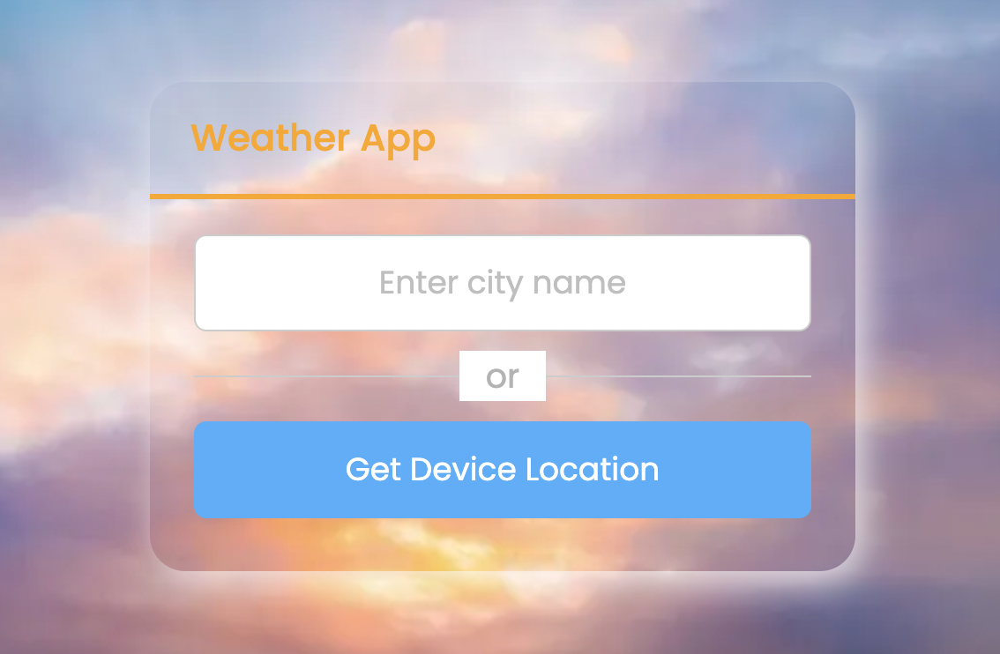

# ⛅ Weather App
&nbsp;&nbsp;&nbsp;&nbsp; It is a landing-page/website where user can click to choose their own current location or enter the name of a city. Once user has pressed enter or clicked on the location button, the weather details pertaining to that city will show up in a neat format. Appropriate errors will be displayed if input is incorrect or geolocation of user is not allowed.

## Deployment

Check out the weather app website here --> Demo: [Weather App](https://checkoutweather.herokuapp.com/)

## How to Start
&nbsp;&nbsp;&nbsp;&nbsp; The main files that you will need from this repo are: "Public" folder, app.js, weather-index.html, and Procfile (necessary for Heroku deployment). You will also need to add/create a ".dev" file within which you will be adding your api key with a line like so: "API_KEY = your-api-key-here". This api key can be acquired on the OpenWeatherMap.org website. Just register on their website and get a free api key. Put all above said files inside a single folder of your choice. Name this folder appropriately like: "Weather App Folder". 

&nbsp;&nbsp;&nbsp;&nbsp; Make sure you have downloaded the 'nodejs' runtime environment as it is needed for this project ('npm' downloads automatically with download of 'nodejs'). The 'package.json' and 'package-lock.json' files will be created automatically when you type the "npm init" command when inside the project directory point in the terminal/command-line. (for example, on command line or terminal: ~/documents/API/Weather App % npm init). The 2 dependencies that need to be installed are: express and dotenv. This can be done in the command-line with the command: " npm install ^dependency-name^ ". 

&nbsp;&nbsp;&nbsp;&nbsp; The whole project will be deployed online using Heroku. To do so, we first have to signup on Heroku's website and then download the 'Heroku CLI' from devcenter.heroku.com to use the heroku commands on our command-line/terminal. (Note: this requires 'git' version control system so make sure you have 'git' installed on your computer as well). We can then type "heroku login" in command line and enter our email & password that you signed up to heroku with. Heroku defines a dynamic port on the go so remember to use 'process.env.PORT'. The Procfile is necessary because Heroku uses Procfile which specifies the commands that are executed by the app on startup. 

&nbsp;&nbsp;&nbsp;&nbsp; Once we have everything in our folder and our command line is pointing to our current project directory, we can use the git commands: "git init" then "git add ." then ' git commit -m "adding files" ' and then we use our heroku CLI commands. This is "heroku create" and then followed finally with "git push heroku master". This should now deploy our website successfully.

## Tools Used

&nbsp;&nbsp;&nbsp;&nbsp; This website uses basic **HTML5** and **CSS3** along with **JavaScript** for interactivity. **NodeJS** was used in the backend to hide sensitive data like api-key from the user. Thus on the front-end, if a person were to use the developer tools and access the javascript files, it will not contain any sensitive information. Similarly, checking the network tool will not show the api-key as it everything is NOT written in the front-end. This demonstrates the advantage of having a back-end. **Express** framework was used on top of nodeJS to simplify some of the code to make the project more readable and efficient. **Heroku** was used for the web hosting purposes/deploying the app.

&nbsp;&nbsp;&nbsp;&nbsp; The website also uses Google Fonts (for styling text) and Box Icons (for icons) and icons8 (for the favicon).

## Authors

  * **Rahul Solaiappan**

## Acknowledgement
The website was developed with help from Angela Yu's course on Udemy called "The Complete Web Development Bootcamp", a YT video from CodingNepal called "Build A Weather App in JS" and "Hiding API Keys with dotenv" from The Coding Train.
